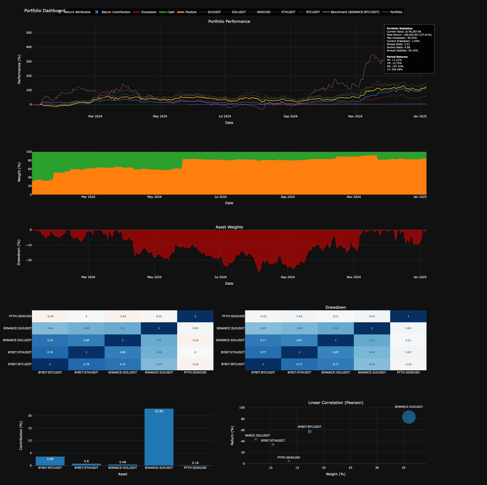
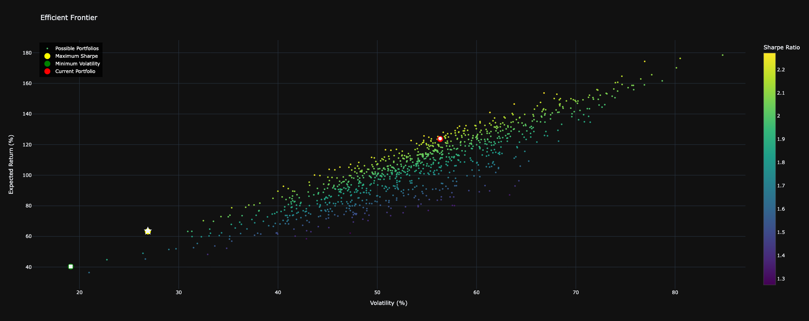

# Crypto Portfolio Manager 📊
[](https://www.python.org/downloads/)
[](https://opensource.org/licenses/MIT)

A robust Python library for managing and analyzing cryptocurrency portfolios with advanced metrics, performance tracking, and visualization capabilities.

## 🌟 Features
- **Real-time Data Integration**: Fetch and store market data from multiple exchanges
- **Portfolio Tracking**: Track positions, trades, and performance metrics
- **Advanced Analytics**: Calculate Sharpe ratio, Sortino ratio, drawdowns, and correlations
- **Risk Management**: Value at Risk (VaR) calculation and efficient frontier analysis
- **Interactive Visualizations**: Comprehensive dashboards with Plotly
- **Unit-based Accounting**: Accurate performance tracking with cash flow adjustments

## 📊 Portfolio Dashboard


The dashboard provides a comprehensive view of your portfolio including:
- Performance tracking with benchmarks
- Asset allocation over time
- Drawdown analysis
- Correlation matrices
- Return attribution

## 📈 Portfolio Optimization


Optimize your portfolio using Modern Portfolio Theory:
- Generate efficient frontier
- Find optimal portfolio allocations
- Balance risk and return
- Compare current allocation with optimal portfolios

## 🚀 Quick Start
```bash
# Clone the repository
git clone https://github.com/danilmezor/portfolio_tracker.git
cd crypto-portfolio-manager

# Install dependencies
pip install -r requirements.txt
```

## Basic usage example:
```python
from src.portfolio_manager import Portfolio, MarketDataManager

# Initialize portfolio with market data manager
portfolio = Portfolio(
    storage_path="portfolio.db",
    market_data_path="market_data.db",
    initial_deposit=1000000
)

# Add positions
portfolio.add_position("BTCUSDT", "BINANCE")
portfolio.add_position("ETHUSDT", "BINANCE")

# Get portfolio summary
summary = portfolio.get_portfolio_summary()
```
Check out the example notebook for more detailed usage.

## 📦 Installation Requirements
```
pandas>=1.2.0
numpy>=1.19.0
plotly>=4.14.0
sqlite3
pytz
tvdatafeed
```

## 🤝 Contributing
Contributions are welcome! Please feel free to submit a Pull Request.

Fork the repository
Create your feature branch (git checkout -b feature/AmazingFeature)
Commit your changes (git commit -m 'Add some AmazingFeature')
Push to the branch (git push origin feature/AmazingFeature)
Open a Pull Request

## 📝 License
This project is licensed under the MIT License - see the LICENSE file for details.

## 📧 Contact
Danil Zanozin - @danilmezor
Project Link: https://github.com/danilmezor/portfolio_tracker

## ⭐️ If you found this project helpful, please consider giving it a star!

## 🙏 Acknowledgments
TVDatafeed for market data integration
Modern Portfolio Theory for optimization algorithms
Plotly for interactive visualizations
